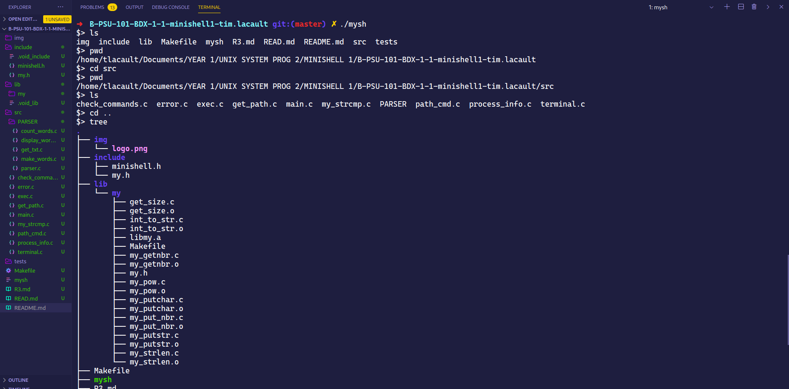

<!-- PROJECT LOGO -->
<br />
<p align="center">
  <a href="https://github.com/TLacault">
    
  </a>

  <h2 align="center">README</h2>
  <h3 align="center">B-PDG-300 | RUSH 03</h3>
</p>

<!-- TABLE OF CONTENTS -->
<details open="open">
  <summary><strong>Table of Contents</strong></summary>
    <strong>
      <ol>
        <li><a href="#about-the-project">About The Project</a></li>
        <li><a href="#installation">Installation</a></li>
        <li><a href="#usage">Usage</a></li>
        <li><a href="#contact">Contact</a></li>
      </ol>
  </strong>
</details>

<!-- ABOUT THE PROJECT -->
## About The Project
<p align="center">
    <a href="https://github.com/TLacault">
        
    </a>
</p>


<br />

## RULES :
* <strong>The totality of your source files, except all useless files (binary, temp files, obj
files,...), must be included in your delivery.</strong>

<strong>The *alloc, free, *printf, open and fopen functions, as well as the using namespace keyword, are forbidden in C++.</strong>

<strong>Let’s be clear: this rush does not aim to make you completely re-implement GKrellM.</strong>

* <strong>However, you are expected to create a clone of it.
The subject is purposefully the least restrictive of the three rushes, so that you can feel free to enjoy yourselves and add whatever you want to your program.
However, dat ain’t no party, and a few mandatory steps must be validated first.</strong>

<strong>This rush consists in three core steps and a bonus step.
Each step must be done entirely and perfectly before the next is started, as they are increasingly difficult</strong>

* <strong>Do not start the second step as long as the first isn’t perfectly functional.</strong>

* <strong>Your system monitor can be seen as a module container.
It is possible to activate and deactivate the available modules so that users can adapt the information to
their needs, or even reorder them however they want.</strong>

* <strong>GKrellM doesn’t need privileged rights to run correctly, and neither should your monitor.</strong>
<br />

<!-- INSTALLATION -->
## Installation

* <strong>Clone the repo</strong>
  ```sh
  git clone git@github.com:EpitechPromo2025/B-PDG-300-BDX-3-1-PDGRUSH3-tim.lacault.git
  ```

<!-- USAGE EXAMPLES -->
## Usage

* <strong>Compile and call functions</strong>

  ```sh
  $ > soon
  ```

<!-- CONTACT -->
## Contact

* <strong>Mail Pro - tim.lacault@epitech.eu</strong>
* <strong>Mail Pro - gabriel.dehm@epitech.eu</strong>
* <strong>Mail Pro - hugo.lumet@epitech.eu</strong>
* <strong>Mail Pro - theo.mainguenaud@epitech.eu</strong>

* <strong>Project Link : </strong>[RUSH 03](https://github.com/EpitechPromo2025/B-PDG-300-BDX-3-1-PDGRUSH3-tim.lacault)
