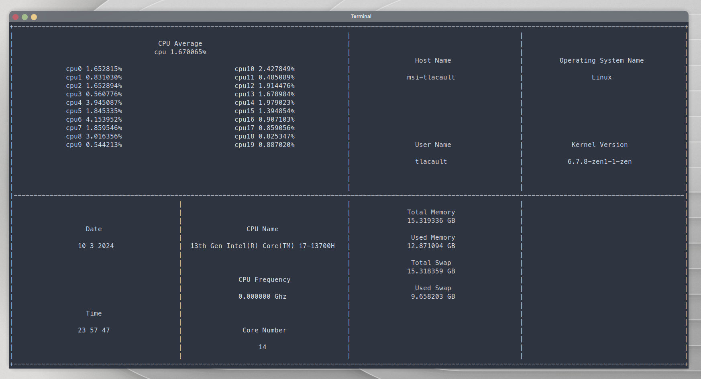

# HTOP Light 🍃

[](https://github.com/TLacault/htop-light)

## About 
* **C++ lighter implementation of the HTOP tool**
* **Hardware** : memory (used, swap), processor (usage, name, frenzy) cores (number, usage)
* **Software** : Hostname, Username, Operating system, Kernel version, Date / Time

## Technologies & Tools

[](https://isocpp.org/) [](https://invisible-island.net/ncurses/) [](https://cmake.org/)

[](https://code.visualstudio.com/) [](https://git-scm.com/) [](https://github.com/) [](https://www.linux.org/) [](https://www.archlinux.org/)


## Clone The Repository
* **Clone with HTML**

```
git clone https://github.com/TLacault/htop-light.git
```

* **Clone with SSH**

```
git clone git@github.com:TLacault/htop-light.git
```

## Dependencies

* **CMake**
* **Ncurses**


## Usage
* **Build the project**

```
make
```

* **Run the game**

```
./game_sdl
```


## Contact
* **Tim Lacault - tim.lacault@etu.u-bordeaux.fr**
